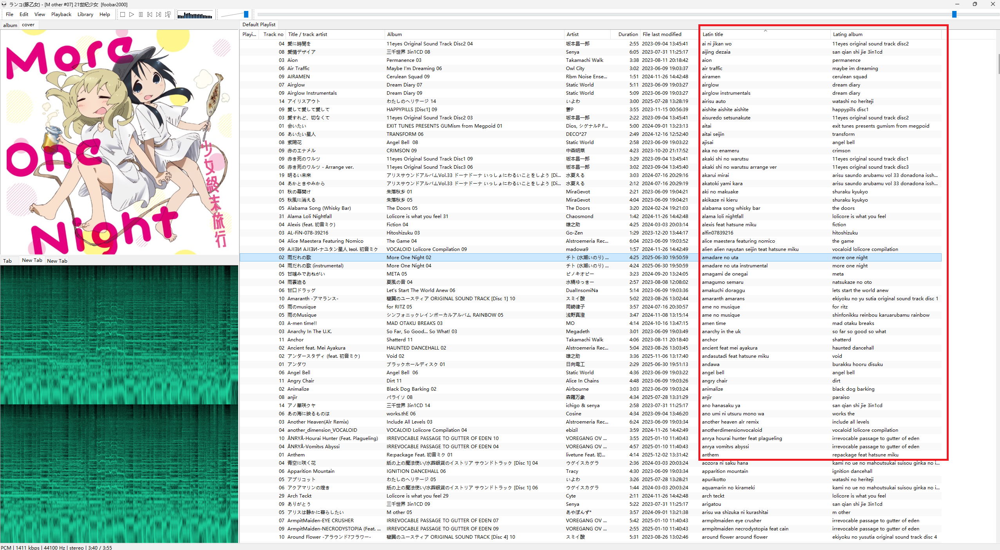

本组件基于 foobar2000 SDK 自带的 foo_sample 改造，使用 vibe coding 完成。

已实现功能：
* 将曲目标题与专辑名拉丁化（仅保留 A-Z/0-9 与空格），支持中文拼音与日文罗马音
* 右键菜单批量生成拉丁化结果，并刷新元数据
* 清理功能：清空当前选中条目的拉丁化结果（全清/仅标题/仅专辑）
* 内置缓存数据库（默认保存在 profile 目录），避免重复请求
* 暴露标题格式字段：%foo_latin_title% 与 %foo_latin_album%
* 首选项页面可配置 API URL / API Key / 模型 / Prompt / 缓存路径，并提供测试入口

重要文件与职责：
* main.cpp：组件入口与基础注册信息
* latinize.cpp / latinize.h：核心逻辑（请求接口、解析结果、缓存、字段暴露、批处理任务）
* preferences.cpp：首选项 UI 与配置项存取
* contextmenu.cpp：右键菜单入口
* foo_sample.rc / resource.h：资源与字符串定义
* foo_sample.sln / foo_sample.vcxproj：工程与编译配置

项目布局（关键目录）：
* foo_sample\：示例工程源文件目录（本组件主要代码在根目录下）
* packages\：NuGet 依赖
* x64\ / Release\ / Release FB2K\：本地构建输出目录
* Mac\ / foo_sample.xcodeproj / foo_sample.xcworkspace：macOS 侧工程示例

编译配置方式与 SDK 的 foo_sample 完全一致，按原工程与配置直接编译即可。

